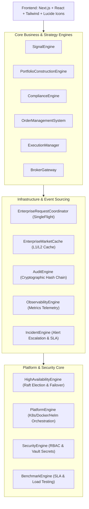

# Enterprise AI Financial Analyst Architecture

## High-Level System Architecture

The **Enterprise AI Financial Analyst Platform** is structured into 37 production-complete, decoupled subsystems across 4 functional layers:

## System Decoupling & Principles
1. **Single Responsibility Principle**: Every engine owns exactly one domain (e.g. `SecurityEngine` owns identity, `PlatformEngine` owns deployment metadata, `OMS` owns order states).
2. **Lazy Late-Bound Singletons**: Engines use private lazy initializer functions (`_get_sec_engine()`, `_get_obs_engine()`) to eliminate circular dependencies.
3. **Thread-Safe Concurrency**: Reentrant locks (`threading.RLock()`) protect shared memory state across multi-threaded execution.
4. **Cryptographic System of Record**: `AuditEngine` maintains an append-only hash chain signed via SHA-256 for complete regulatory audit compliance.
